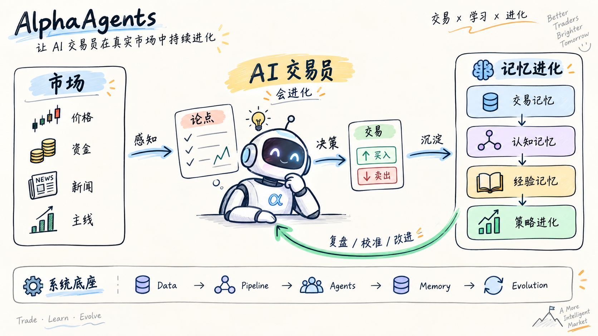
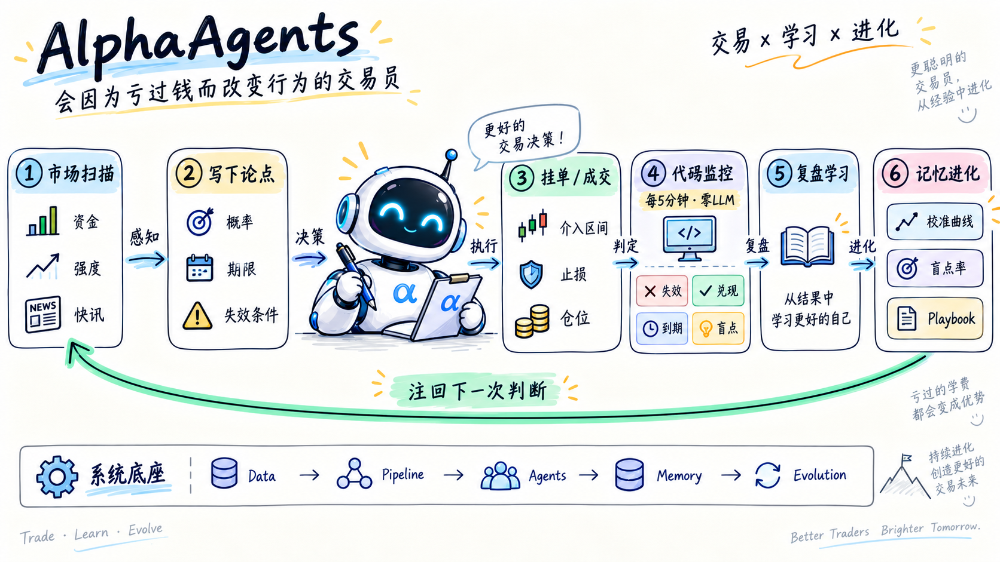
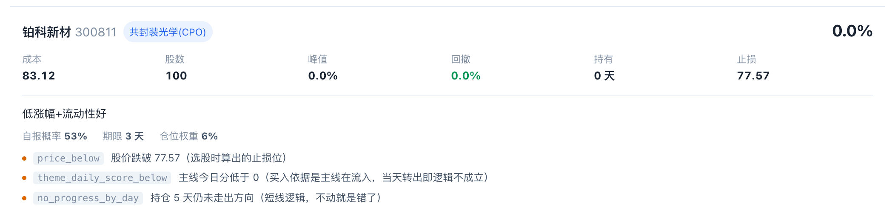
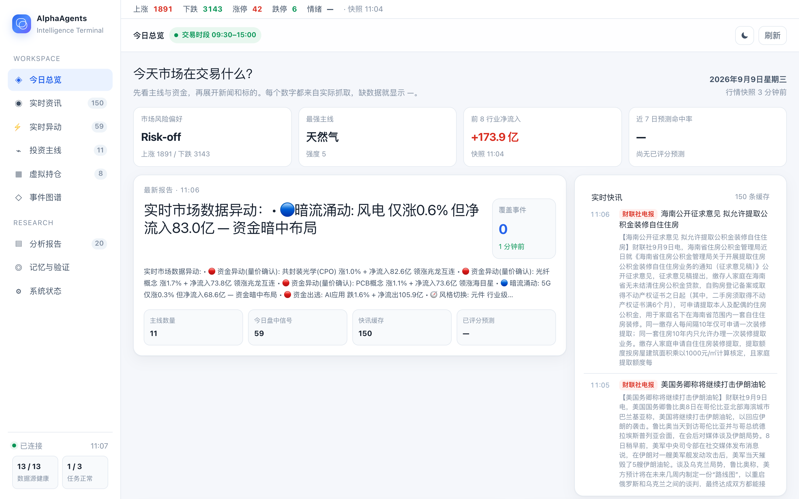
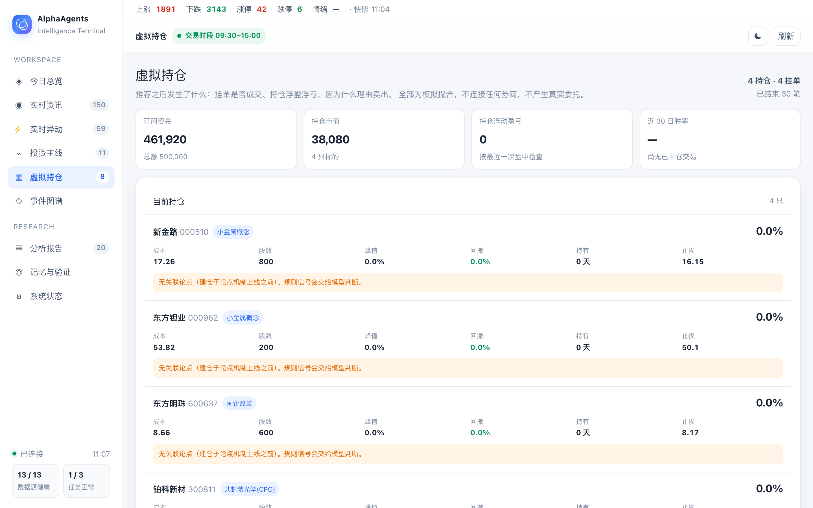

<div align="center">

# AlphaAgents

### 会因为亏过钱，而改变下一次判断的 AI 交易员

**Trade · Learn · Evolve**

[](https://github.com/KylinMountain/AlphaAgents/actions/workflows/harness.yml)
[](LICENSE)


A 股短线 · 虚拟盘 · 不接券商接口

</div>

---



大多数 AI 交易系统在给出 **Buy / Sell** 的那一刻就结束了。

AlphaAgents 不一样。

它会：

**观察市场 → 写下论点 → 交易 → 判断自己哪里错了 → 形成记忆 → 改变下一次判断**

目标不是做一个更聪明的选股器。

> **而是养出一个会从真实交易中持续进化的 AI 交易员。**

---

## How it works



核心闭环只有六步：

**市场扫描 → 写下论点 → 挂单 / 成交 → 代码监控 → 复盘学习 → 记忆进化**

每一次交易都会留下经验，并重新进入下一次判断。

---

## What makes it different?

|                  | AlphaAgents                   |
| ---------------- | ----------------------------- |
| 🔍 **先看资金，再找原因** | 先发现真正发生资金异动的板块，再从快讯中寻找催化      |
| 📝 **持仓的单位是论点**  | 每次买入都必须声明概率、期限，以及「什么发生就说明我错了」 |
| ⚙️ **代码负责盯盘**    | 失效条件每 5 分钟由代码检查，平静时无需反复调用 LLM |
| 🧠 **交易会形成记忆**   | 校准、盲点、教训、Playbook 会重新注入下一次决策  |

---

## Memory → Evolution

AlphaAgents 不只记录盈亏。

它试图区分：

* **判断没错，只是没赌赢**
* **论点确实失效了**
* **时间到了，但行情没发生**
* **被风控平仓，但自己根本没想到这种失败方式**

最后一种叫：

### `blind_spot`

它代表的不是一次亏损，而是：

> **AI 的认知里缺了一块。**

这些结果会逐渐形成：

**交易记录 → 校准 / 盲点 → 教训 → Playbook → 原则 → 新策略**

最终重新反馈给下一次决策。

---

## Thesis, not ticker

AlphaAgents 买入的不是一只股票，而是一条**可以被证伪的论点**。

```json
{
  "claim": "小金属主线持续走强，个股存在补涨机会",
  "prob": 0.60,
  "horizon_days": 5,
  "size_pct": 0.03,
  "invalidations": [
    {"kind": "price_below",             "value": 49.5, "note": "跌破止损位"},
    {"kind": "theme_daily_score_below", "value": 0,    "note": "主线当天转弱"},
    {"kind": "no_progress_by_day",      "value": 5,    "note": "短线逻辑，不动就是错了"}
  ]
}
```

`kind` 只能取自封闭词汇表，所以每一条都能被代码零成本判定。
写表外的名字会被丢弃并告警——**一条读不懂的条件，比没有条件更糟。**

> **LLM 负责思考，代码负责守纪律。**

这不是示意图——下面是真实持仓页上的一条，三个失效条件由服务端从判定引擎
读的同一张表渲染，**页面不可能把一个条件描述成跟触发它的代码不一样**：



<details>
<summary>完整界面</summary>

| 今日总览 | 虚拟持仓 |
|:--:|:--:|
|  |  |

</details>

---

## 可信与可审计

一个会从自己的交易里学习的系统，最容易骗的是自己。

所以每一条「我学到了」都能被机器复核，而且「学到的经验」与「可以生效的知识」之间有一道闸门：

| 它防的是 | 做法 |
| --- | --- |
| 事后把决策依据改成「我早就看好」 | 建单即冻结 `decision_snapshots`（介入区间 / 止损 / 目标 / 理由 / `information_cutoff`）；`BEFORE UPDATE` / `BEFORE DELETE` 触发器直接拒绝改写，哈希可独立复算 |
| 同股双交易员，结果记到别人头上 | 归属**存成列**（`thesis → order → exits`），不靠「按代码就近匹配」重推 |
| 「预测对了」和「这笔赚了」被压成一个标签 | 三类结果各自独立存储、互不覆盖；平仓永远不会重写预测标签 |
| 把「没交易」当成「打平」，冒充成技能证据 | 未成交报 `fills=0` 且 `return_pct=None`，不是一个 0 收益 |
| 让模型给自己打分 | 记忆 / 原则 / Playbook 的效用只来自市场数据；提示词里不含胜率与战绩 |
| 一次走运被自动写成一条原则 | 未验证经验只进候选区，**没有自动晋升路径**；生效要人显式批准并留下不可变快照 |
| 「我们批准的是哪一版」说不清 | 批准落成不可变快照（谁 / 何时 / 因为什么 / 哪一版）；版本哈希**不含**会自己变的计数器 |
| 修正被原地覆盖，看不出改过什么 | 修正是**追加**一行并指名被替代的那行，旧行始终可读 |

> **LLM 负责思考，代码负责守纪律，市场负责打分。**

一处如实说明：已批准知识快照目前是**存证**（记录「生效了什么」），尚未接管检索闸门 ——
未批准的知识行仍可能被渲染进提示词。把「未批准即不生效」做成强制属于下一阶段，
现状与缺口见 [`docs/TRADER_CORE_IMPLEMENTATION.md`](docs/TRADER_CORE_IMPLEMENTATION.md) §7。

---

## Current status

> **✅** = 机制已交付，有测试钉住　**🧪** = 代码已存在，但要有真实交易样本才有意义

| 能力 | 状态 |
| --- | :-: |
| Agent 自动选股 | ✅ |
| 论点 / 概率 / 期限 / 失效条件 | ✅ |
| 挂单 / 成交 / 持仓 / 平仓 | ✅ |
| 盘中自动监控 | ✅ |
| 资金异动 → 快讯追因 | ✅ |
| 决策留痕与不可改写 | ✅ |
| 交易结果可归因（同股双交易员不串账） | ✅ |
| 三类结果互不覆盖（预测 / 交易 / 过程） | ✅ |
| 校准 / 盲点率 / 过程质量回注决策 | ✅ |
| Playbook / 原则 / 教训 | ✅ |
| 候选知识隔离（验证 ≠ 授权） | ✅ |
| 已批准知识快照（生效记录） | ✅ |
| Champion / Challenger 前向闸门 | 🧪 |
| 有统计意义的校准曲线与原则 | 🧪 |

> 系统骨架已经完成，但进化能力需要真实交易样本逐渐「养」出来 —— **机制在跑，结论还要等样本**。
>
> 两个 🧪 的准确含义：前向闸门 `evolution/holdout_gate.py` 已实现且有测试，
> 但尚未接入任何生产路径（没有影子候选在跑）；校准曲线与原则的效用要有足够样本才有统计意义。

---

## Architecture

依赖只朝一个方向走，反向 import 会被 `scripts/lint_harness.py` 在 CI 里拦下来：

```text
data → sources → tools → evolution → pipeline → agents → server
```

| 层 | 负责 | 不负责 |
| --- | --- | --- |
| `data/` | SQLite schema 与读写、评分、决策上下文、交易账本（订单 / 退出 / 论点 / 决策快照）、归属 | 不访问网络 |
| `sources/` | 快讯源，各自归一成同一种形状 | 不做判断 |
| `tools/` | Agent 可调用的行情查询：报价、资金流、涨跌家数、退出信号 | 不持有状态 |
| `evolution/` | 记忆效用、原则、Playbook、前向闸门 | 不靠调 LLM 来决策 |
| `pipeline/` | 调度器与它的任务、快讯摄入循环 | 不含策略规则 |
| `agents/` | LLM 提示词，以及包在它们外面的 runner | 不直接写存储 |
| `server/` | FastAPI、WebSocket、看板 | 不含值得测试的逻辑 |

一天是这样跑的：

```text
00:00–23:59  news_ingest       每 5 分钟，全周 —— 让库一直是热的
09:00        morning_scan      回看窗口到昨天收盘
09:25        opening_reminder
09:30–15:00  intraday_monitor  每 5 分钟；有异动才调用 LLM
15:30        review            校验 → 评分 → 学习 → 闸门
20:00        night_scan
周六 10:00    weekly_report
```

摄入是连续的（因为信息源是连续的），消费是开窗的（因为任务是开窗的），两者在 `news_items` 相遇。

主要目录：

```text
alpha_agents/
├── data/         # 交易账本、归属、决策快照、SQLite schema
├── sources/      # 快讯源，各自归一
├── tools/        # Agent 可调用的市场查询
├── evolution/    # 校准 / 盲点 / 教训 / Playbook / 原则 / 前向闸门
├── pipeline/     # 调度器与各任务
├── agents/       # 提示词 runner
├── prompts/      # 提示词模板（.md）
└── server/       # FastAPI + 看板
web/              # React + Vite 前端
```

更完整的推导见：

- [`docs/TRADER_CORE_DESIGN.md`](docs/TRADER_CORE_DESIGN.md) —— 目标态（规范，不是进度表）
- [`docs/TRADER_CORE_IMPLEMENTATION.md`](docs/TRADER_CORE_IMPLEMENTATION.md) —— **代码里已经存在什么**，以及什么还没做
- [`ARCHITECTURE.md`](ARCHITECTURE.md) —— 分层、数据库地图、一天的调度
- [`docs/thesis_design.md`](docs/thesis_design.md) —— 为什么持仓的单位是论点

---

<details>
<summary><b>Quick Start</b></summary>

### 1. 安装

```bash
git clone git@github.com:KylinMountain/AlphaAgents.git
cd AlphaAgents

uv sync
cp .env.example .env
```

### 2. 配置模型

```env
SILICONFLOW_API_KEY=sk-xxx

AGENT_API_KEY=sk-xxx
AGENT_BASE_URL=https://dashscope.aliyuncs.com/compatible-mode/v1
AGENT_MODEL=qwen-plus
```

兼容 OpenAI API 风格的模型服务。

### 3. 构建新闻索引

```bash
uv run python main.py build-index
```

然后启动系统即可。

</details>

---

## Philosophy

传统量化在优化规则。

LLM Agent 在生成判断。

AlphaAgents 想做的是第三种东西：

> **让 Agent 的判断经过市场验证，再把经验变成下一次判断的一部分。**

不是：

```text
Model → Recommendation
```

而是：

```text
Trade → Learn → Remember → Evolve
```

---

## Disclaimer

本项目仅用于研究与虚拟盘实验，不构成任何投资建议。

所有判断均可能出错。

---

## License

AGPL-3.0

详见 [LICENSE](LICENSE)。

---

<div align="center">

### Trade · Learn · Evolve

**让每一次交易，都成为下一次判断的一部分。**

</div>
